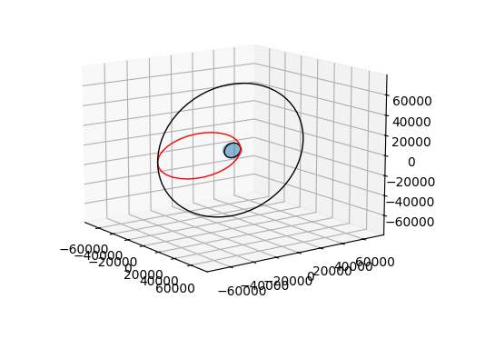

# Space Utilities

A repository of space related utilities that I have built out.

## Hohmann Transfer
Currently there is just a simple Hohmann transfer tool to generate 3D graphs of a transfer manuever and print the total delta-v needed for that maneuver.  
It is pretty simple and does not include factors such as drag, etc.  Additionally, it does not currently support inclination changes.
